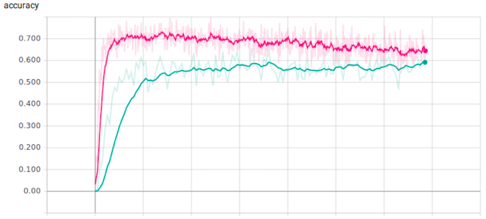

# CrabNet
Link prediction in Knowledge Bases using text classification.

## Pre-request libraries
- python3
- tensorflow

### Requirements
[nvidia-docker](https://github.com/NVIDIA/nvidia-docker#quick-start) is used for reliable GPU support in the containers. This is an extension to Docker and can be easily installed with just two commands.
To run the networks, you need an Nvidia GPU with >1GB of memory (at least Kepler).

## 1. Data preparation (FB15K dataset example)
Datasets are required in the following format, containing five files:

**triple2id.txt:** triples ids file, the first line is the number of triples for training. Then the follow lines are all in the format (e1, e2, rel).

**entity2id.txt:** all entities and corresponding ids, one per line. The first line is the number of entities.

**relation2id.txt:** all relations and corresponding ids, one per line. The first line is the number of relations.

**ent_embeddings_transE.txt:** all entity features (128 dimension), one per line.

**rel_embeddings_transE.txt:** all relation features (128 dimension), one per line.

You can find all the FB15K data in the data folder.
## 2. TransE
Manipulating large knowledge graph can be challenging. To address scalability and performance issues, a state-of-the-art solution is to embed knowledge graph components (entities and relation types) into a low-dimensional continuous vector space while preserving some properties of importance for a given discovery task.

In **TransE**, relationships can be represented as translations in the embedding space. We want the embedding of the object entity close to the learned embedding of "subject + relation" for a given fact of "subject, relation, object" in the KG, while "subject + relation" should be far away from the object if the fact is wrong.

One of the most intuitive application of TransE is the **Entity Prediction**.

Once the model has learned the embedding vector for each entity and relationship type, predictions will be performed using the same translation approach in the embedding space. The prediction for a given "subject - relation type" is evaluated by picking the nearest neighbor entity of the translation of the "subject" by the "relation type". In other words, the prediction task corresponds to the query: "What is the most likely object associated to a given subject entity and a given relation type?"

We can get two embeddings of the entity and the relation:
* ent_embeddings_transE.txt
* rel_embeddings_transE.txt
 

## 3. Train and test the model
Run the model.py file with suitable papermeters, which you can find inside the file.

## 4. Results:
The result is evaluated based on the FB15K dataset.
 

